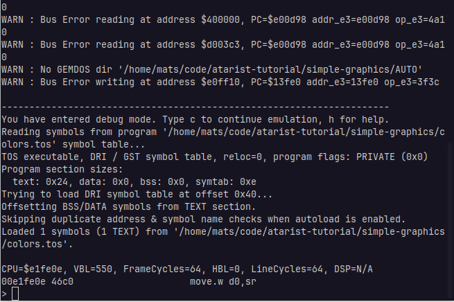

+++ 
draft = false
date = 2025-09-07T20:42:21+02:00
title = "Debugging in Hatari"
description = "We will make mistakes, let's see how we can debug them."
slug = ""
authors = []
tags = []
categories = ["68000", "Atari ST", "debugging"]
externalLink = ""
series = []
+++

Let's expand on our previous little example and use it to show how to
do debugging in the Hatari emulator. There are many tools to do
debugging on hardware as well, but it may be easier to do this on a
modern machine.

We will continue on the Simple Graphics example we just concluded and
start waiting for Vertical Blank after each color shift. That way it
wont just flicker and shift the entire picture instead.

The previous code is available in a [git
repo](https://github.com/cybermats/atarist-tutorial/tree/main/simple-graphics/colors.s).

We looped as fast as possible, only doing a `nop` to delay the loop at bit.

``` nasm
loop:
	add.w #$1111,(a0) 	; Circle the colors
	nop 			    ; Wait a short while
	bra.s loop 		    ; Loop forever
```

In XBIOS we have a routine called
[Vsync](https://freemint.github.io/tos.hyp/en/Screen_functions.html#Vsync),
which blocks until the next vertical sync signal. Previously we've
made calls to GEMDOS through `trap #1`. Calling to XBIOS is very
similar, except we use `trap #14`.

Replacing the `nop` with a call to VSync should make the program fade the entire
screen a bit nicer.

``` nasm
loop:
	add.w #$1111,(a0) 	; Circle the colors
	
	move.w #37,-(sp)    ; 37 is the opcode for VSYNC
	trap #14            ; Call XBIOS
	addq.l #2,sp        ; Clean up the stack

	bra.s loop 		    ; Loop forever
```

Unfortunately it crashes when we run this in Hatari.


# How to Debug #

Hatari offers a full suite of [debugging
tools](https://www.hatari-emu.org/doc/debugger.html). For our case we
will go through how to set a breakpoint for Program Start and then how
to step through the code to see what went wrong.

Start by pressing *AltGR + Pause* in the Hatari screen to enter the
debugger. Note that you will have to have started Hatari from a
console (or a Command window if you are on Windows). This will pause
the emulation and put you in the debug console.



Since our program isn't very long we can put a breakpoint at the start
of the program and then step through it. We can do this by setting a
breakpoint when Pexec is called.[^1]

Type in the following in the debug console:

```shell
b GemdosOpcode = 0x4B && OsCallParam = 0x0
```

Then continue the emulation with `c`, click in the Hatari window and
press any key to close the crashed program. This will bring you to a
GEM desktop with the background color being off.


Open the harddrive, *C:*, and start the `colors.tos` program. This
should pause the emulation and bring up the debug console again.


Now we want to break when our code actually starts running, so we add
a new breakpoint when we reach the first TEXT section.

```shell
b  pc = TEXT :once
```

Then use `c` to continue and we should now have advanced to where our
code starts.


We can disassemble the code to see that it's the same that we have
compiled using `d`/`disasm` for disassemble.


If you *step* (`s`) and/or *next* (`n`) your way through the code you
will eventually discover that we crash on the second go through
`loop`, on `add.w #$1111,(a0)`. You can inspect the registers with
`r`, see if you can spot the bug.


What has happened is that the address register `a0` was overwritten by
the call to Vblank. Reading through the documentation tells us that
only `d3`-`d7` and `a3`-`a7` are guaranteed to be unaltered, all
others may change.

The solution is either to push and pop `a0` to the stack, or to write
the address to the background palette inside the loop.

One solution is the following:

```nasm
loop:
	move.w #37,-(sp) 	; Wait for Vblank 
	trap #14
	addq.l #2,sp

	move.l #$ff8240,a0
	add.w #$1111,(a0) 	; Circle the colors

	bra.s loop 		; Loop forever
```

The solution is available in a [git
repo](https://github.com/cybermats/atarist-tutorial/tree/main/simple-graphics/vbl-colors.s).


# References #

[^1]: 
	https://www.hatari-emu.org/doc/debugger.html#Breakpoint_variables
