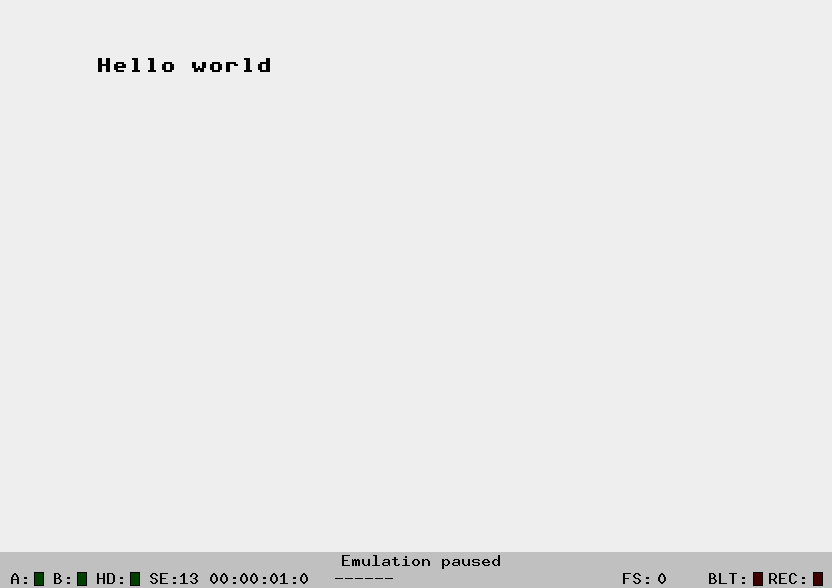

+++ 
draft = false
date = 2025-09-04T17:04:19+02:00
title = "Hello world"
description = "Write a simple Hello World for the Atari ST"
slug = ""
authors = []
tags = ["68000", "Atari ST"]
categories = []
externalLink = ""
series = []
+++

What does an assembly program look like that displays "Hello world" on the Atari ST?

The code is available in a [git repo](https://github.com/cybermats/atarist-tutorial/tree/main/helloworld).

```nasm
	text
	move.l #msg,-(sp)	; Address of the string on the stack
	move #$09,-(sp)		; PTR LINE
	trap #1			    ; Call GEMDOS
	addq.l #6,sp		; Correct stack
	

	move.w #1,-(sp)		; CONIN
	trap #1			    ; Call GEMDOS
	addq.l #2,sp		; Correct stack
	
	clr.w -(sp)		    ; TERM
	trap #1			    ; Call GEMDOS

	data

msg:	
	dc.b 'Hello world',$0d,$0a,0
	
```

To run this you need to compile it, for example with vasm.

```shell
	vasmm68k_mot hello.s -Ftos -o hello.tos
```

and then you can run it using hatari as follows:

```shell
	hatari hello.tos
```

And you should see the following output:



# Fundamentals #

To understand this code we have to go through a few things:

* What registers are availble on the 68000
* Where the stack is located
* How you move (or load) data into registers
* GEMDOS
* How to call a software interrupt

###### Registers ######
We have 8 data registers (d0-d7), and 8 address register
(a0-a7). These are all general-purpose 32 bit registers.

Then we have the program counter (PC), the stack register (SR) and the
condition code register (CCR).

All registers can be used for bit fields, byte (8 bits), word (16
bits), long-word (32 bits) and quad-word (64 bits) operations. 

###### Stack  ######
The stack exists in the address register `a7`. You can address it
either through `a7` or `sp`, both are interchangeable.

There are actually two types of stack pointers, "User Stack Pointer"
and "Supervisor Stack Pointer", but we will not go into that right
now.

###### Load data ######
Loading, or moving, data in and out of registers is done with the
`move` operation. You will also have to specify the width of the data
you are moving as well, which is done using a suffix to the
mnemonic. For example, `move.l #$ff8240,a0` moves a long-word (32
bits) value of $ff8240 into the `a0` register, and `move.w #$000,(a0)`
moves a word (16 bits) into the memory location that `a0` points at.

###### Software interrupts ######
To call a software interrupt you use the `trap` operator. Calling
routines from GEMDOS is done this way, but there are many other
routines and helpers available through `trap`, and you can add your
own as well.

###### GEMDOS ######
The OS on Atari is called
[TOS](https://freemint.github.io/tos.hyp/en/tos_about.html), and the
different abstraction layers you can access to get help are called
BIOS, XBIOS and
[GEMDOS](https://freemint.github.io/tos.hyp/en/gemdos_about.html). There
are many different routines in there to help you with Files, Date and
Time, Processes, Memory management etc to name a few. What we are
using in this example are [Character
I/O](https://freemint.github.io/tos.hyp/en/gemdos_chrinout.html) and
[Process
functions](https://freemint.github.io/tos.hyp/en/gemdos_process.html).


# Walkthrough #

## Print line ##

The way to call GEMDOS routines is through software interrupt using
`trap`. The interrupt vector lists all software interrupts that are
available, and we use `trap #1` to get GEMDOS. BIOS is using `trap
#13` in contrast.

To pass parameters to the GEMDOS routines we put them on the stack in
reverse order. I.e. first the parameters to the routing, then to
GEMDOS. So in this case we pass in the address of the Message we want
to print using `move.l #msg,-(sp)`, then we specify that we want to
call Print Line by putting the opcode for PTR LINE on the stack, 
`move #$09,-(sp)`. Finally we call `trap #1` to invoke GEMDOS.

This will then print out the text on Standard Output, which is the
entire screen.

To clear the stack we need to pop the parameters we added to it, which
we do by simply adding to the address register using `addq.l #6,sp`.

## Wait for key ##

To let the user see the text we wait for a key press before
terminating our process. This is done using the CONIN (Character
Console Input) routine. It doesn't take any parameters, so the only
thing we put on the stack is the routine opcode for GEMDOS, 
`move.w #1,-(sp)`.

We call it using `trap #1` as before, which will block until we press
a key. Following that we have to clean up the stack as before.

## Exit the process ##

Now we're ready to leave the process, which we do through GEMDOS
again, using the opcode for TERM which is 0, `clr.w -(sp)`. This will
terminate the process with an exit code of 0, i.e. Success.

All done!
