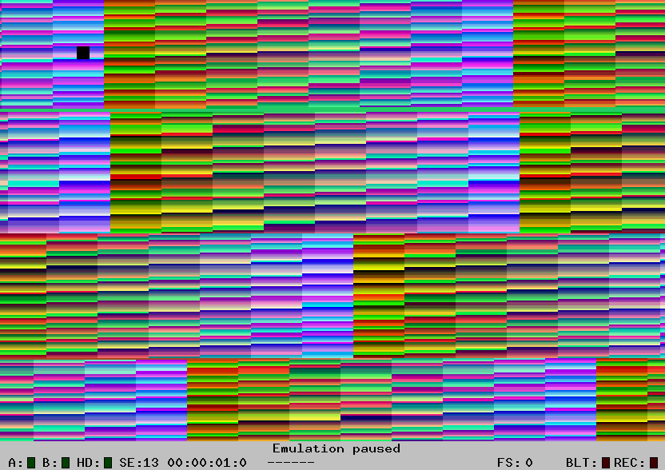

+++ 
draft = true
date = 2025-09-05T22:04:56+02:00
title = "Simple Graphics"
description = "A very simple, graphical program for the Atari ST"
slug = ""
authors = []
tags = ["68000", "Atari ST"]
categories = []
externalLink = ""
series = []
+++

Let's write a minimal assembly program which cycles the background color. 

The code is available in a [git repo](https://github.com/cybermats/atarist-tutorial/tree/main/part01).


``` nasm
	;; A very simple example Atari ST program

	;; Put the CPU in the "Supervisor" mode by calling the GEMDOS
	;; routine "Super", which you do by calling trap with argument $20.
	
	move.l #0,-(a7)		; Argument to "Super", which tells it to switch 
		                ; to "Supervisor" mode.
	move.w #$20,-(a7)	; $20 is the routine number for "Super".
	trap #1 		    ; Call GEMDOS

	;; Now we're in supervisor mode, which gives us full control
	;; of the machine.
				
	move.l #$ff8240,a0	; Store the address of the background
				        ; color register in a0

	move.w #$000,(a0) 	; Set the background to black

loop:
	add.w #$1111,(a0) 	; Circle the colors
	nop 			    ; Wait a short while
	bra.s loop 		    ; Loop forever
```

To run this you need to compile it, for example with vasm.

```shell
	vasmm68k_mot colors.s -Ftos -o colors.tos
```

and then you can run it using hatari as follows:

```shell
	hatari --confirm-quit false  colors.tos
```

Which should produce the following beautiful effect:




Let's break it down!

# Fundamentals #

To understand this code we have to go through a few things:

* How to branch
* Supervisor mode

###### Branching ######
The most basic branching is the Branch Always operator, which is given
a displacement. This can be 8 bit or 16 bits long allowing for shorter
or longer jumps. The shorter version is using the suffix `.s` for
single-precision. In this example we're using `bra.s loop` to jump to
a loop that is close by.

###### Supervisor mode ######

The 68000 has two modes, User and Supervisor. The User Mode limits
what you can do in order to give an OS more control and make it harder
for user programs to crash the computer. To get out of it and into the
"Supervisor Mode" we can use a GEMDOS System Function called
"[Super](https://freemint.github.io/tos.hyp/en/gemdos_system.html#Super)".

## Walkthrough ##


GEMDOS Functions are invoked through Software Traps, specifically
`trap #1`. The parameters to the functions are given in inverse order
on the stack, so the last argument is stored as the first on the
stack. The last thing added to the stack is the GEMDOS Function
number.

Sending `0` as argument will ask `super` to switch between "User" and
"Supervisor", and we put that on the stack, followed by the opcode for
`super` which is `$20` hex. Finally we issue `trap #1` to call GEMDOS.


``` nasm
	move.l #0,-(a7)
	move.l #$20,-(a7)
	trap #1
```

When we're in supervisor mode we have access to the entire machine. We
can now access the memory registers that the Atari ST has, such as the
one that controls the background color. The 16 color palette that we
have available in low resolution mode can be accessed these memory
registers. The full list can be [found
here](https://temlib.org/AtariForumWiki/index.php/IDE,_Memory_control_%26_video),
but we're only intrested in the background color which is on address `$FFFF8240`.

The palette is a 16 bit word, where bit 0-2 adjust blue, 4-6 green, and 8-A red, as described below.

```
	FEDCBA9876543210
	.....rrr.ggg.bbb
```

To start a loop where the color changes quickly we start by setting
the address register `a0` to the address of the background color
register. Then we set the color to black.

``` nasm
	move.l #$ff8240,a0
	move.w #$000,(a0)
```

Finally we just increase the color by a small value and keep looping.

``` nasm
loop:
	add.w #$1111,(a0)
	nop 			 
	bra.s loop 		 
```

To get out of this loop you have to reset or restart the computer.

# References #
* [68000 Reference Manual](https://www.nxp.com/docs/en/reference-manual/M68000PRM.pdf)
* [TOS References](https://freemint.github.io/tos.hyp/en/tos_about.html)
* [Atari ST Internals, The authoritative insider's guide](https://www.synacktiv.com/ressources/Atari-ST-Internals.pdf)
